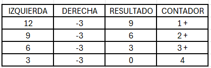
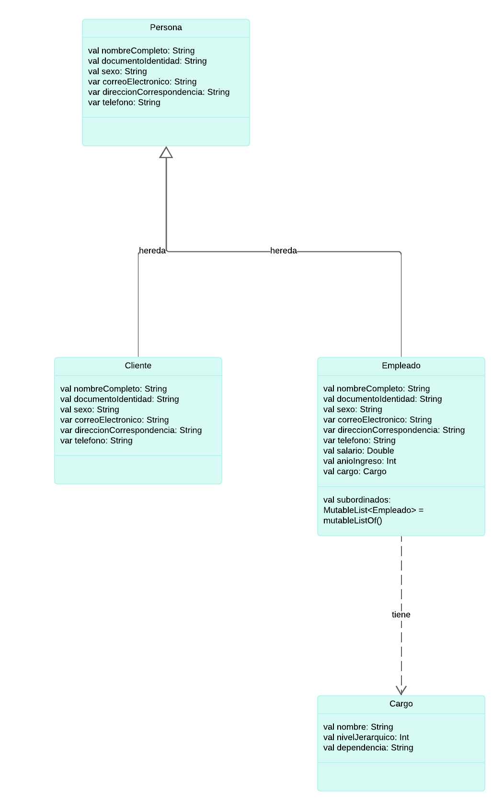

## Explicación Función Recursiva
Vamos a basarnos en esta imagen para poder hacer el metodo de recursividad donde: El lado izquierdo va ser el dividendo y el lado derecho el divisor.
<div align="center"> 
  


</div>
Por lo tanto izquierda y derecha van a ser los parametros de entrada y segundo  realizamos una condición tirando a la verdad 12 > 3  si es verdad se hace recursividad, pero sino retornará 0.
Aunque la condición que esta en el siguiente metodo tambien tira a la verdad, pero con una negación

### Ejemplo
(12<3) esto es falso, pero si negamos esta condición de nuevo !(12<3) va ser verdadero y hacemos recursividad y si esto es falso retornará el 0 de nuevo.
Ahora vamos a definir la función que retornará la cantidad de veces que se hacer el conteo, en este caso seria cuantas veces va hacer la resta, por lo tanto:

```kotlin
fun recursiveFunction(izquierda:Int, derecha:Int): Int{
    if(derecha == 0){
       return throw IllegalArgumentException("No se puede dividir por cero")
    }else if(!(izquierda < derecha)){
         return recursiveFunction(izquierda-derecha, derecha) + 1
    }else{
        return 0
    }  
}
```
Luego de esto vamos para poder hacer el segundo ejercicio nos vamos a basar en el diagrama de clases:                       
### Imagenes
- Diagrama de Clases:


<div align="center"> 
  


</div>

